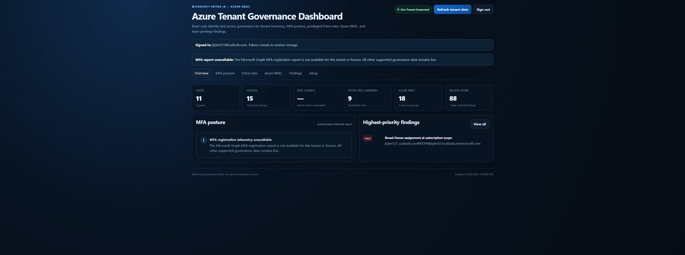
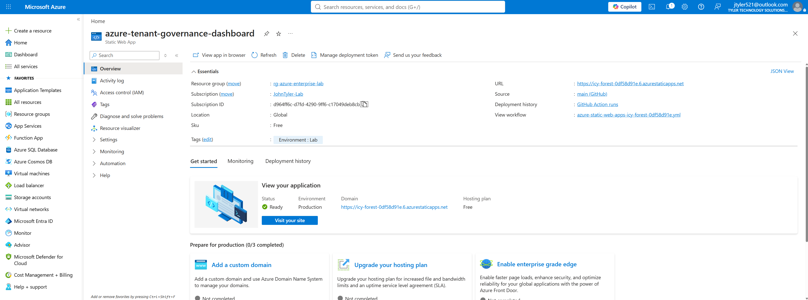

# Azure Tenant Governance Dashboard

A read-only JavaScript/Vite web app for Microsoft Entra ID and Azure access governance. The dashboard authenticates a tenant reader/admin with MSAL, queries Microsoft Graph and Azure Resource Manager, then produces an interactive governance snapshot focused on identity posture, MFA, privileged access, Azure RBAC, and least privilege.

## Live deployment

**Production Azure Static Web App:** https://icy-forest-0df58d91e.6.azurestaticapps.net

The dashboard is deployed from this repository through GitHub Actions to Azure Static Web Apps and is connected to Microsoft Entra ID, Microsoft Graph, and Azure Resource Manager for live tenant governance data.

### Live tenant dashboard



### Azure Static Web App deployment



## What it does

- Inventories Entra users, guest users, groups, and service principals.
- Reviews MFA-capable, MFA-registered, and passwordless-capable users.
- Enumerates active Entra directory roles and their members.
- Inventories Azure RBAC role assignments at subscription and resource scopes.
- Flags broad Owner, Contributor, and User Access Administrator assignments.
- Flags privileged Entra identities that are not reported as MFA-capable.
- Flags guest identities with broad Azure access.
- Produces a lightweight governance review score.
- Exports findings as JSON or CSV.

The app is intentionally **read-only**. It does not perform Graph or Azure write operations.

## Architecture

```text
Browser SPA
  |
  |-- MSAL.js / OAuth 2.0 Authorization Code + PKCE
  |      |
  |      +-- Microsoft Entra ID
  |
  |-- Microsoft Graph
  |      |-- Users / Groups / Service Principals
  |      |-- Directory Roles
  |      +-- Authentication Methods Registration Report
  |
  +-- Azure Resource Manager
         |-- Role Assignments
         |-- Role Definitions
         +-- Resource Groups
```

There is no application backend. Access tokens are handled by MSAL in session storage. Tenant data remains in browser memory unless you explicitly export a findings file.

## Local development

```bash
npm install
npm run dev
```

Open the local Vite URL, normally:

```text
http://localhost:5173
```

## Microsoft Entra app registration

Create a dedicated app registration for this dashboard.

### Authentication

Under **Authentication**, add a **Single-page application (SPA)** platform and configure:

```text
http://localhost:5173
```

After Azure Static Web Apps deployment, also add the production origin, for example:

```text
https://<your-static-web-app>.azurestaticapps.net
```

If you later use a custom domain, add that origin as another SPA redirect URI.

### Microsoft Graph delegated permissions

Add:

- `User.Read`
- `Directory.Read.All`
- `RoleManagement.Read.Directory`
- `AuditLog.Read.All`

Grant tenant admin consent where required.

The Authentication Methods registration report uses `AuditLog.Read.All` and also depends on the signed-in user's Entra permissions/role.

### Azure Service Management delegated permission

Add:

```text
https://management.azure.com/user_impersonation
```

The signed-in identity also needs Azure authorization that allows reading role assignments at the selected scope. A read-oriented Azure role at the subscription or target scope is appropriate for this dashboard.

## Configure the app

Open the dashboard's **Setup** tab and enter:

- Tenant ID
- Application / Client ID
- Azure Subscription ID

These values are identifiers, not secrets.

**Do not add a client secret to this SPA.**

## Deploy with Azure Static Web Apps

Recommended flow:

1. Use this GitHub repository as the source repository.
2. In the Azure portal, create an **Azure Static Web App**.
3. Connect:
   - Repository: `johninfra/azure-tenant-governance-dashboard`
   - Branch: `main`
4. Use Vite build settings:
   - App location: `/`
   - Output location: `dist`
   - Build command: `npm run build`
5. Azure creates a GitHub Actions workflow in this repository.
6. After deployment, copy the Azure Static Web Apps URL.
7. Add that URL to the Entra app registration as an SPA redirect URI.
8. Open the deployed dashboard, enter the tenant/client/subscription identifiers, and sign in.

## Security model

- No client secrets are expected or supported.
- No tenant access tokens should ever be committed to GitHub.
- MSAL authentication cache uses `sessionStorage`.
- Only non-secret identifiers are persisted in `localStorage`.
- Microsoft Graph and Azure Resource Manager calls are read-only.
- Findings exports are generated locally in the browser.
- The dashboard's review score is a heuristic, not a security certification or compliance attestation.

## Suggested GitHub topics

`azure` `microsoft-entra-id` `iam` `rbac` `mfa` `identity-governance` `msal` `microsoft-graph` `azure-security` `javascript`

## Portfolio value

This project demonstrates hands-on work with:

- Microsoft Entra ID
- OAuth 2.0 / PKCE
- MSAL.js
- Microsoft Graph
- Azure Resource Manager REST APIs
- Azure RBAC
- MFA posture review
- identity governance
- least privilege
- cloud security monitoring
- Azure Static Web Apps
- GitHub-to-Azure deployment workflows

## License

MIT
